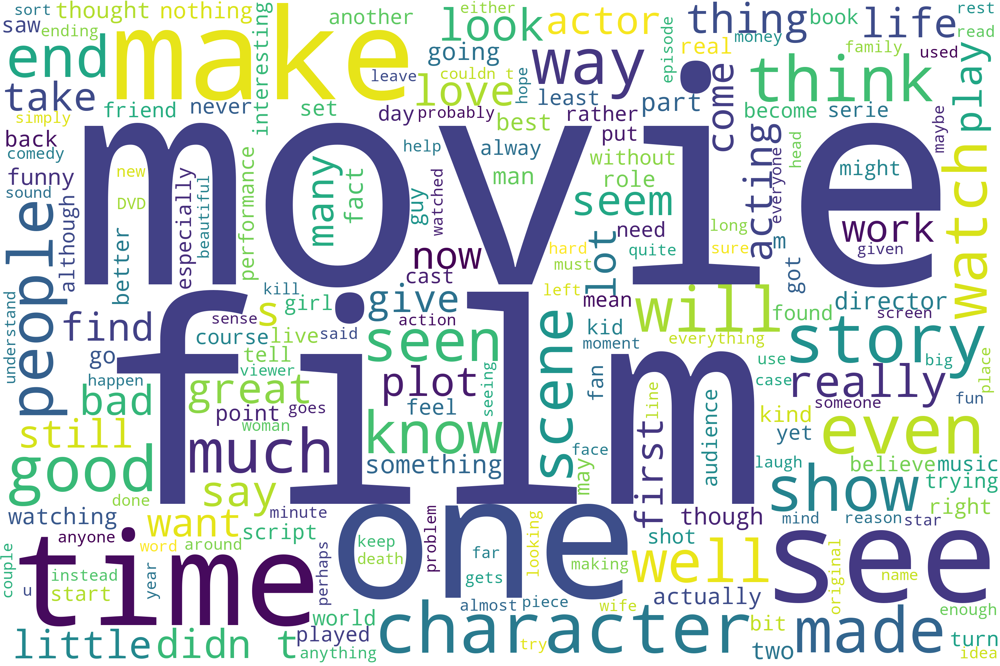
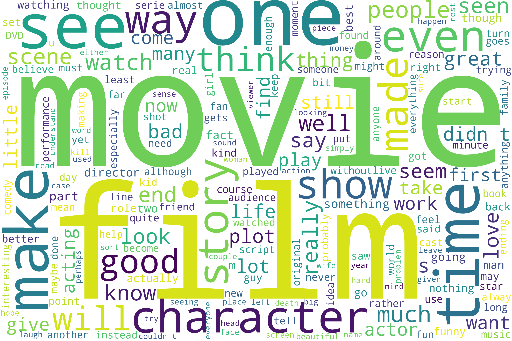

# Sentiment Classification

Performance Analysis of Probabilistic and Machine Learning Models.

<i>This small project was part of the `Information Theory and Probabilistic Programming` class for Fall 2021 at the University of Oklahoma.</i>

**Algorithms/Models:**

* Probabilistic & traditional ML algorithms team:
  * XGBoost.
  * NGBoost.
  * Naïve Bayes.
  * Logistic Regression.
  * Decision Tree.
  * Random Forest.
  * Support Vector Machines (SVMs)
* Deep learning team:
  * Bidirectional LSTM + Convolutional Neural Network (CNN).
  * Bidirectional GRU + Convolutional Neural Network (CNN).

**Dataset:**

- [Stanford Large Movie Review Dataset](https://ai.stanford.edu/~amaas/data/sentiment/)
- Published by [Stanford AI Lab](https://ai.stanford.edu/).
- Collected from movie reviews on IMBD.
- Contains around 50K movie reviews, split into 25K for training and 25K for testing purposes. Though the dataset size is a bit small, it is a common dataset size for the sentiment classification task because it is challenging to find a larger labeled dataset.
- Citation (credit): <i>Maas, Andrew L. and Daly, Raymond E. and Pham, Peter T. and Huang, Dan and Ng, Andrew Y. and Potts, Christopher, [Learning Word Vectors for Sentiment Analysis](http://www.aclweb.org/anthology/P11-1015).</i>

**Data Preprocessing/Wrangling:**

The next two figures show the most 200 common words in corpus (all 50K reviews).

<figure>

<figcaption align= "center"><i>Figure 1</i> Most 200 used words in dataset</figcaption>
</figure>

<figure>

<figcaption align= "center"><i>Figure 2</i> Most 200 used words in dataset (Ignoring stopwords)</figcaption>
</figure>

**Vocabulary size:**

Experimented with a few values (e.g., 10K, 15K, 20K, 50K) and decided to use 30,000 words as the vocabulary size. Larger vocabulary values were mostly words that were mentioned only once in the whole corpus, so to avoid overfitting the corpus data and generalize well, I found 30K to be the best vocabulary size for my methods.

**Text representation:**

* Word Embeddings: [GloVe: Global Vectors for Word Representation](https://nlp.stanford.edu/projects/glove/), used the 300-dimensional vector representation.
* Term Frequency Inverse Document Frequency (TF-IDF): used an implementation which adds smoothing* when computing IDF.

<i>*Smoothing is just adding 1 to the denominator term when computing the IDF score for a word, this way we can avoid dividing by zero. </i>

**Data preprocessing steps:**
* Unpack abbreviations: English abbreviations like `I’ve` were replaced with the unpacked version `I have`, this step was initially performed when representing text using word embeddings because GloVe Word Embeddings do not contain vector representation for these abbreviations, so I had to unpack them to capture their meaning. However, for consistency purposes, this step was applied to the data which used TF-IDF representation, I tried to make the setup almost the same to really compare the performance of traditional and probabilistic machine learning algorithms with neural networks.
* Remove punctuation.
* Remove non-English characters.
* Remove extra whitespaces.
* For word embeddings:
    * Tokenize reviews.
    * Create an embedding matrix.
* For TF-IDF:
    * The corpus was represented in a TF-IDF representation with a `30,000` vocab size.

## Results:

**Note:**
Regarding the accuracy of the models, after looking up online implementations using this dataset, it seems that the range of accuracy is 80% ~ 85%.
Therefore, this was considered as a standard to compare to. It’s important to note that the main goal is not to achieve the highest possible accuracy in this application, the goal is to compare accuracies of probabilistic and deep learning models and see if the probabilistic solutions, which requires much less computation power than neural networks (most of the time), will achieve better results or not. 

| **Method**                           | **Validation** | **Test**     |
| ------------------------------------ | -------------- | ------------ |
| **Deep learning team**               |
| Bi-LSTM + Conv                       | _82.84%_       | _82.04%_     |
| Bi-GRU + Conv                        | _83.5%_        | _83.76%_     |
| **Probabilistic & traditional team** |
| XGBoost                          | _99.3%_        | _89.02%_     |
| NGBoost                          | _81.12%_       | _81.42%_     |
| Naïve Bayes                      | _90.76%_       | _86.78%_     |
| Logistic Regression              | _95.05%_       | _90.12%_     |
| Decision Trees                   | _100%_         | _71.4%_      |
| Random Forests                   | _100%_         | _84.8%_      |
| Support Vector Machine (SVM)     | _98.68%_       | **_90.46%_** |

**Deep learning team winner:** 
Bi-GRU + Conv with a test accuracy of 83.67%

**Probabilistic team and overall winner:** 
SVM with a test accuracy of 90.46%

 

Thank you.
